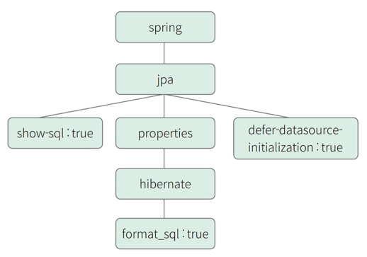

Git : https://github.com/shinsunyoung/springboot-developer-2rd

https://velog.io/@code-10/%EB%A1%AC%EB%B3%B5-AllNoArgsConstructor-%EC%A0%9C%EB%8C%80%EB%A1%9C-%EC%95%8C%EA%B3%A0-%EC%82%AC%EC%9A%A9%ED%95%B4%EB%B3%B4%EC%9E%90

@AllArgsConstructor 
어노테이션은 클래스의 모든 필드 값을 파라미터로 받는 생성자를 자동으로 생성한다. 
이 어노테이션을 사용하면, 클래스의 모든 필드를 한 번에 초기화할 수 있다.

@NoArgsConstructor 
어노테이션은 파라미터가 없는 디폴트 생성자를 자동으로 생성한다. 
이 어노테이션을 사용하면, 클래스에 명시적으로 선언된 생성자가 없더라도 인스턴스를 생성할 수 있다.

@RequiredArgsConstructor 
어노테이션은 final이나 @NonNull으로 선언된 필드만을 파라미터로 받는 생성자를 자동으로 생성한다. 
이 어노테이션을 사용하면, 클래스가 의존하는 필드를 간단하게 초기화할 수 있다.
